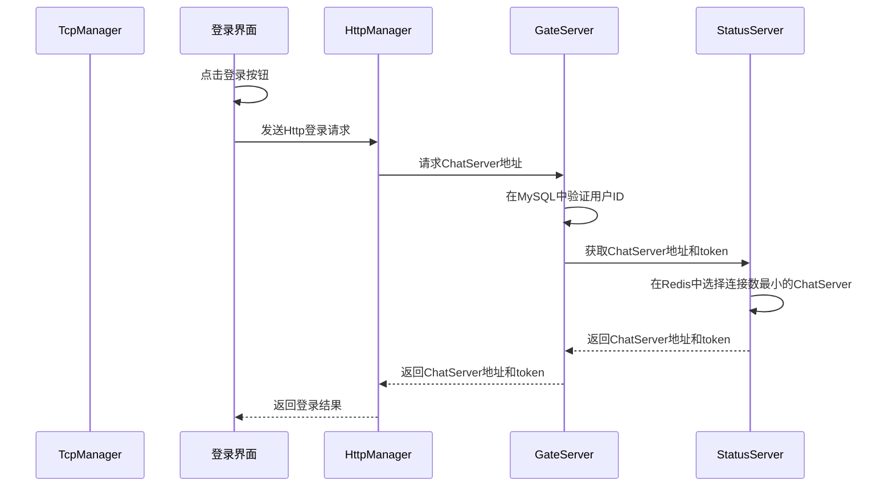
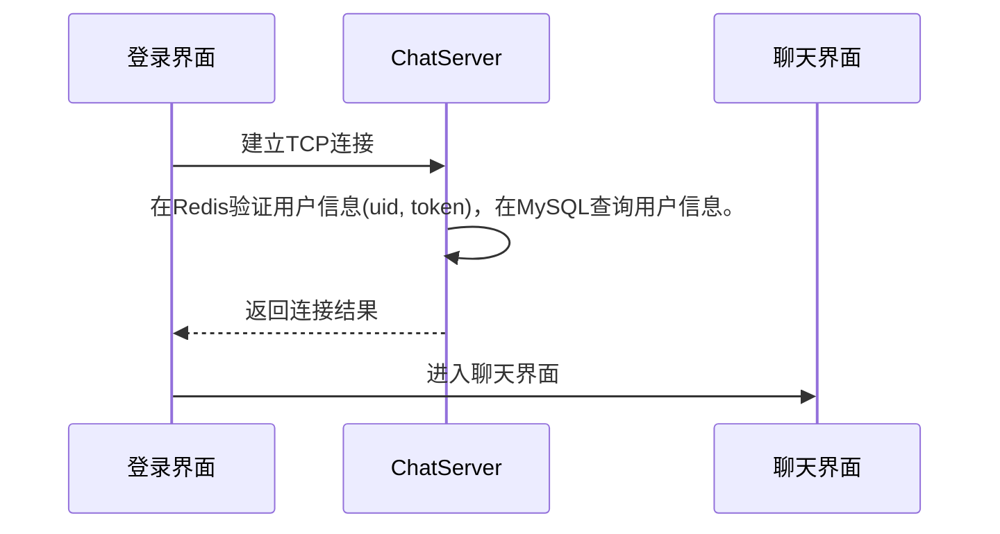
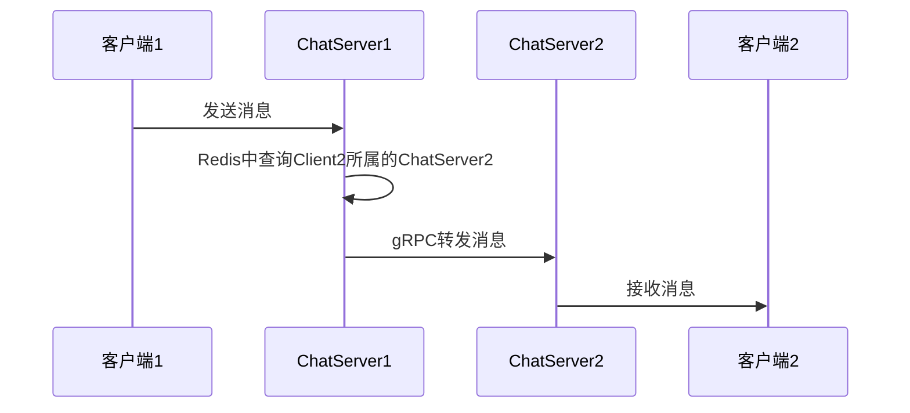

# ChatRoom登录和通信流程

## 各个模块功能介绍

1. `LoginDialog`：登录界面。
2. `TcpManager`：负责**直接和ChatServer**建立TCP长连接。
3. `HttpManager`：处理HTTP请求，负责与GateServer网关服务器进行通信。
4. `ChatDialog`：聊天界面，登录成功后进入该界面。
5. `GateServer`：网关服务器，负责分发注册和登录的请求，向`StatusServer`获取合适的聊天服务器。
6. `StatusServer`：状态服务器，提供用户和聊天服务器地址的映射关系，对聊天服务器**负载均衡**。存储`uid`, `token`, `chat_server_address`等信息。
7. `ChatServer`：聊天服务器，与客户端建立TCP长连接，处理用户的聊天请求和消息。存储`uid`, `chat_server_address`等信息。

解释：

+ **Redis**：用户的状态信息主要由Redis保存，如`uid_to_server`, `uid_to_token`,`chatserver_connection_count`
+ `StatusServer` 主要提供聊天服务器地址的负载均衡。
+ **ChatServer**：处理具体的聊天请求，通过GRPC在不同的ChatServer间通信。保留用户的`uid`和`session`。
+ **HttpManager**：`LoginDialog`发起登录请求后，`HttpManager` 会向 `GateServer` 发送请求获取`ChatServer`的地址和token。
+ **GateServer**：向 `StatusServer` 请求获取聊天服务器地址和 token。
+ **StatusServer**：在Redis中选择连接数最小的`ChatServer`，并返回给`GateServer`。
+ **TcpManager**：向`ChatServer`发送请求建立连接，并验证用户信息(`uid, token`)。
+ **ChatServer**：在`Redis`中验证用户信息（如果没有就随机生成 token，`ChatServer` 向 MySQL 数据库进一步验证用户信息），并且在MySQL中查询用户信息，返回给客户端。

### 1. 向GateServer请求获取聊天服务器地址和登录token

登录过程中，只有在请求`ChatServer`地址时，才会涉及`GateServer`和`StatusServer`。

### 2. 与ChatServer建立TCP长连接

当客户端获取到 `ChatServer` 地址后，会直接通过 `TcpManager` 向 `ChatServer` 发起TCP连接请求。

### 3. Client1和Client2进行通信

在客户端之间通信时，`ChatServer1` 会通过 `Redis` 查询 `Client2` 所在的 `ChatServer2` 地址。

然后再通过 `gRPC` 将消息转发给 `ChatServer2`。

