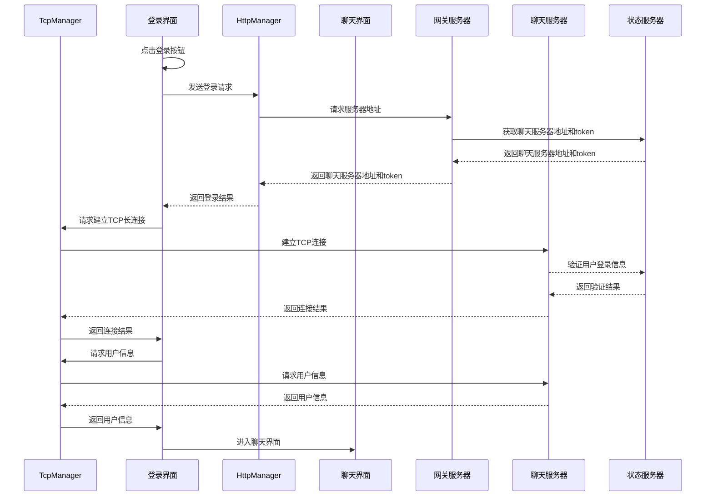

# Login登录流程

## 各个模块功能介绍

1. `LoginDialog`：登录界面，用户输入账号密码进行登录。
2. `TcpManager`：负责直接和ChatServer建立TCP长连接。
3. `HttpManager`：处理HTTP请求，负责与GateServer网关服务器进行通信。
4. `ChatDialog`：聊天界面，登录成功后进入该界面。
5. `GateServer`：网关服务器，负责分发请求和获取ChatServer聊天服务器地址。
6. `StatusServer`：状态服务器，提供用户状态和聊天服务器地址等信息。存储`uid`, `token`, `chat_server_address`等信息。
7. `ChatServer`：聊天服务器，处理用户的聊天请求和消息。存储`uid`, `chat_server_address`等信息。

解释：

+ `StatusServer` 和 `ChatServer` 都会存储用户的状态信息，`StatusServer` 主要提供用户状态和聊天服务器地址等信息，并对 `ChatServer` 进行负载均衡，而 `ChatServer` 则处理具体的聊天请求。
+ 在 `LoginDialog` 中，用户输入账号密码后，`HttpManager` 会向 `GateServer` 发送请求获取聊天服务器地址和 token。
+ `GateServer` 会向 `StatusServer` 请求获取聊天服务器地址和 token（由 `StatusServer` 生成），然后返回给 `HttpManager`，`HttpManager` 再将结果(`uid, name, token`)返回给 `LoginDialog`。
+ 随后，`LoginDialog` 会请求 `TcpManager` 建立 TCP 长连接，`TcpManager` 会向 `ChatServer` 发送请求建立连接，并验证用户信息(`uid, token`)。
+ `ChatServer` 会向 `StatusServer` 验证用户信息（如果没有就随机生成 token，`ChatServer` 向 MySQL 数据库进一步验证用户信息），`ChatServer` 再将结果在本地内存备份一份，再返回给 `TcpManager`，最后 `TcpManager` 将连接结果返回给 `LoginDialog`。

## 登录流程概述

