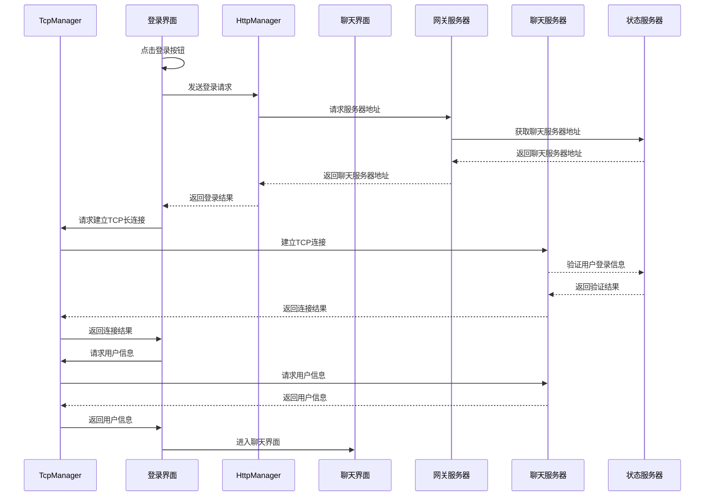

# Login登录流程

```mermaid
sequenceDiagram
    participant TcpManager
    participant LoginDialog as 登录界面
    participant HttpManager
    participant ChatDialog as 聊天界面
    participant GateServer as 网关服务器
    participant ChatServer as 聊天服务器
    participant StatusServer as 状态服务器

    LoginDialog ->> LoginDialog: 点击登录按钮
    LoginDialog ->> HttpManager: 发送登录请求
    HttpManager ->> GateServer: 请求服务器地址
    GateServer ->> StatusServer: 获取聊天服务器地址
    StatusServer -->> GateServer: 返回聊天服务器地址
    GateServer -->> HttpManager: 返回聊天服务器地址
    HttpManager -->> LoginDialog: 返回登录结果

    LoginDialog ->> TcpManager: 请求建立TCP长连接
    TcpManager ->> ChatServer: 建立TCP连接
    ChatServer -->> StatusServer: 验证用户登录信息
    StatusServer -->> ChatServer: 返回验证结果
    ChatServer -->> TcpManager: 返回连接结果
    TcpManager ->> LoginDialog: 返回连接结果
    LoginDialog ->> TcpManager: 请求用户信息
    TcpManager ->> ChatServer: 请求用户信息
    ChatServer -->> TcpManager: 返回用户信息
    TcpManager ->> LoginDialog: 返回用户信息
    LoginDialog ->> ChatDialog: 进入聊天界面
```